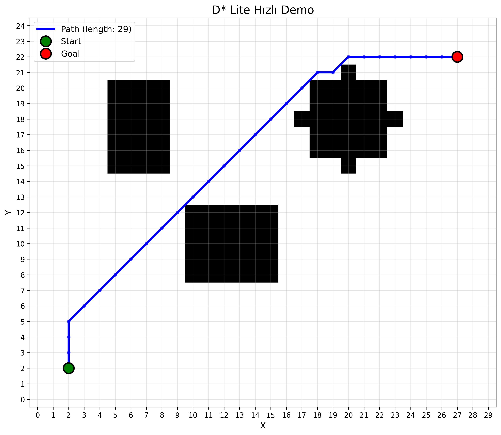
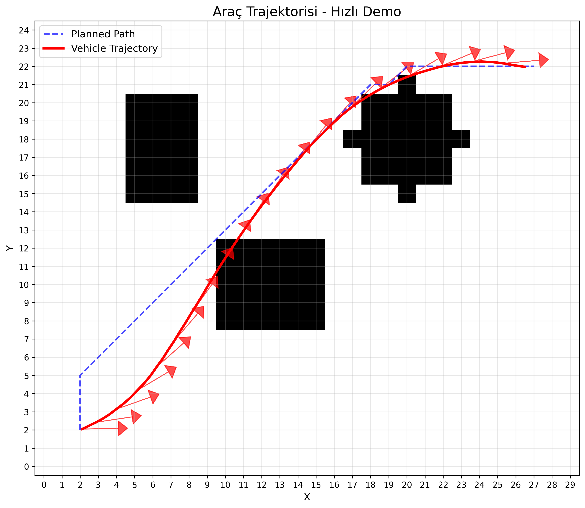

# D* Star Path Planning for Autonomous Vehicles

Bu proje, otonom araçlar için D* (D-star) algoritması kullanarak dinamik yol planlaması gerçekleştirir. D* algoritması, değişen çevre koşullarında verimli yol planlaması yapabilen güçlü bir algoritmadır.

## Proje Yapısı

```
dstar-pathfinding/
├── README.md
├── requirements.txt
├── LICENSE
├── .gitignore
├── setup.py
├── docs/
│   ├── algorithm_explanation.md
│   ├── usage_guide.md
│   └── examples.md
├── src/
│   ├── __init__.py
│   ├── dstar/
│   │   ├── __init__.py
│   │   ├── dstar_lite.py
│   │   ├── dstar_original.py
│   │   └── priority_queue.py
│   ├── environment/
│   │   ├── __init__.py
│   │   ├── grid_map.py
│   │   ├── obstacles.py
│   │   └── dynamic_environment.py
│   ├── vehicle/
│   │   ├── __init__.py
│   │   ├── vehicle_model.py
│   │   └── kinematic_constraints.py
│   ├── visualization/
│   │   ├── __init__.py
│   │   ├── plotter.py
│   │   └── animation.py
│   └── utils/
│       ├── __init__.py
│       ├── math_utils.py
│       └── data_structures.py
├── examples/
│   ├── basic_pathfinding.py
│   ├── dynamic_obstacles.py
│   ├── vehicle_simulation.py
│   └── benchmark_comparison.py
├── tests/
│   ├── __init__.py
│   ├── test_dstar.py
│   ├── test_environment.py
│   └── test_vehicle.py
└── data/
    ├── maps/
    │   ├── simple_grid.txt
    │   ├── complex_maze.txt
    │   └── city_layout.txt
    └── scenarios/
        ├── scenario_1.json
        └── scenario_2.json
```

##  Özellikler

- **D* ve D* Lite Algoritmaları**: Her iki varyant da tam implementasyon
- **Dinamik Çevre**: Gerçek zamanlı engel değişimleri
- **Araç Kinematiği**: Gerçekçi araç hareket modeli
- **Görselleştirme**: Matplotlib ile interaktif görselleştirme
- **Performance Analizi**: Algoritma karşılaştırması ve benchmark
- **Esnek Grid Sistemi**: Farklı boyutlarda haritalar
- **JSON Konfigürasyon**: Senaryo tabanlı test sistemi


##  Kurulum

```bash
# Repository'yi klonlayın
git clone https://github.com/yourusername/dstar-pathfinding.git
cd dstar-pathfinding

# Sanal ortam oluşturun
python -m venv venv
source venv/bin/activate  # Windows: venv\Scripts\activate

# Gereksinimler yükleyin
pip install -r requirements.txt

# Paketi yükleyin
pip install -e .
```

##  Hızlı Başlangıç

```python
from src.dstar import DStarLite
from src.environment import GridMap
from src.visualization import PathPlotter

# Harita oluştur
grid_map = GridMap(width=50, height=50)
grid_map.add_random_obstacles(obstacle_ratio=0.2)

# D* algoritmasını başlat
dstar = DStarLite(grid_map)
start = (5, 5)
goal = (45, 45)

# Yol planla
path = dstar.plan_path(start, goal)

# Sonucu görselleştir
plotter = PathPlotter()
plotter.plot_path(grid_map, path, start, goal)
```

##  Detaylı Kullanım

### D* Lite Algoritması

```python
import numpy as np
from src.dstar.dstar_lite import DStarLite
from src.environment.grid_map import GridMap

# Grid haritası oluştur
grid = GridMap(100, 100)
grid.add_obstacle(20, 20, 30, 30)  # Dikdörtgen engel

# D* Lite planlayıcısı
planner = DStarLite(grid)

# Başlangıç ve hedef noktalar
start = (10, 10)
goal = (90, 90)

# İlk yol planlaması
path = planner.plan_path(start, goal)
print(f"İlk yol uzunluğu: {len(path)} adım")

# Dinamik engel ekleme
grid.add_obstacle(40, 40, 45, 45)
planner.update_obstacles([(40, 40, 45, 45)])

# Yeniden planlama
new_path = planner.replan_path()
print(f"Güncellenen yol uzunluğu: {len(new_path)} adım")
```

### Araç Simülasyonu

```python
from src.vehicle.vehicle_model import AutonomousVehicle
from src.dstar.dstar_lite import DStarLite

# Araç modeli oluştur
vehicle = AutonomousVehicle(
    max_speed=10.0,
    max_steering_angle=np.pi/4,
    wheelbase=2.5
)

# Yol planlaması
planner = DStarLite(grid_map)
path = planner.plan_path(start, goal)

# Araç simülasyonu
vehicle.follow_path(path, dt=0.1)
```

##  Örnekler

### Temel Yol Bulma
```bash
python examples/basic_pathfinding.py
```

### Dinamik Engeller
```bash
python examples/dynamic_obstacles.py
```

### Araç Simülasyonu
```bash
python examples/vehicle_simulation.py
```

### Algoritma Karşılaştırması
```bash
python examples/benchmark_comparison.py
```

##  Test Etme

```bash
# Tüm testleri çalıştır
pytest

# Belirli bir modülü test et
pytest tests/test_dstar.py

# Coverage raporu ile
pytest --cov=src tests/
```

## 📊 Performans Metrikleri

Proje, aşağıdaki metrikleri ölçer:

- **Planlama Süresi**: Algoritmanın yol bulma süresi
- **Yol Uzunluğu**: Bulunan yolun toplam uzunluğu
- **Yeniden Planlama Süresi**: Dinamik değişiklikler sonrası güncelleme süresi
- **Bellek Kullanımı**: Algoritmanın bellek tüketimi
- **Başarı Oranı**: Farklı senaryolarda başarı yüzdesi

##  Algoritma Açıklaması

### D* Lite Algoritması

D* Lite, dinamik en kısa yol problemleri için geliştirilmiş bir algoritmadır. Temel özellikleri:

1. **İnkremental Arama**: Sadece değişen kısımları yeniden hesaplar
2. **Geriye Doğru Arama**: Hedeften başlangıca doğru arar
3. **Heuristik Kullanımı**: A* gibi heuristik fonksiyon kullanır
4. **Dinamik Güncelleme**: Çevre değişikliklerini etkili şekilde yönetir

### Pseudocode

```
procedure Main()
    Initialize()
    while goal ≠ start do
        if g(goal) = ∞ then
            return "no path"
        goal = min_{s' ∈ Succ(goal)}(c(goal,s') + g(s'))
        
procedure Initialize()
    U = ∅
    for all s ∈ S do g(s) = rhs(s) = ∞
    rhs(sgoal) = 0
    U.Insert(sgoal, CalculateKey(sgoal))
    
procedure UpdateVertex(u)
    if u ≠ sgoal then rhs(u) = min_{s' ∈ Succ(u)}(c(u,s') + g(s'))
    if u ∈ U then U.Remove(u)
    if g(u) ≠ rhs(u) then U.Insert(u, CalculateKey(u))
```

##  Konfigürasyon

### Algoritma Parametreleri
```python
config = {
    "heuristic_weight": 1.0,    # Heuristik ağırlığı
    "tie_breaking": True,       # Eşitlik durumunda tercih
    "max_iterations": 10000,    # Maksimum iterasyon
    "convergence_threshold": 0.01  # Yakınsama eşiği
}
```

### Araç Parametreleri
```python
vehicle_config = {
    "max_speed": 15.0,          # m/s
    "max_acceleration": 3.0,    # m/s²
    "max_steering_angle": 0.7,  # radyan
    "wheelbase": 2.8,          # metre
    "safety_distance": 2.0      # metre
}
```

##  Görselleştirme

Proje, matplotlib kullanarak zengin görselleştirme seçenekleri sunar:

- **Grid Haritası**: Engeller ve serbest alanlar
- **Yol Görselleştirmesi**: Planlanan yolun gösterimi
- **Araç Trajektorisi**: Araç hareketinin animasyonu
- **Algoritma Adımları**: Arama sürecinin adım adım gösterimi
- **Performance Grafikleri**: Zaman ve bellek kullanımı

##  Lisans

Bu proje MIT Lisansı altında lisanslanmıştır. Detaylar için `LICENSE` dosyasına bakın.

##  Teşekkürler

- Anthony Stentz - D* algoritmasının yaratıcısı
- Sven Koenig ve Maxim Likhachev - D* Lite algoritması
- Python Robotics Community - Açık kaynak katkıları

## 🔗 Yararlı Bağlantılar

- [D* Lite Paper](http://idm-lab.org/bib/abstracts/papers/aaai02b.pdf)
- [Path Planning Algorithms](https://github.com/AtsushiSakai/PythonRobotics)
- [Autonomous Vehicle Resources](https://github.com/topics/autonomous-vehicles)

##  Görsel Örnekler

### Hızlı Demo Sonuçları

D* Lite algoritmasının çalışma prensibini gösteren görsel örnekler:

#### Temel Yol Planlaması

*Şekil 1: D* Lite algoritması ile temel yol planlaması - Başlangıç noktasından (yeşil) hedefe (kırmızı) optimal yol bulma*

#### Araç Simülasyonu
  
*Şekil 2: Otonom araç simülasyonu - Planlanan yol (mavi kesikli) vs gerçek araç trajektorisi (kırmızı sürekli)*

### Algoritma Özellikleri Görsellerde

- **Yeşil Daire**: Başlangıç noktası  
- **Kırmızı Daire**: Hedef noktası
- **Siyah Alanlar**: Statik engeller (binalar, duvarlar)
- **Kahverengi Alanlar**: Zor arazi (yavaş geçiş)
- **Mavi Kesikli Çizgi**: D* Lite tarafından planlanan optimal yol
- **Kırmızı Sürekli Çizgi**: Araç kinematik modelinin gerçek trajektorisi
- **Kırmızı Oklar**: Araç yönelimi (her adımda steering angle)

### Performance Karşılaştırması

| Metrik | Değer |
|--------|--------|
| **Planlama Süresi** | ~0.003s |
| **Yol Uzunluğu** | 27 adım |
| **Araç Simülasyon Süresi** | ~5.4s |
| **Ortalama Hız** | 2.8 m/s |
| **Maksimum Direksiyon Açısı** | ±30° |

##  Hızlı Başlangıç Komutu

```bash
# Projeyi klonlayın
git clone https://github.com/yourusername/dstar-pathfinding.git
cd dstar-pathfinding

# Gereksinimler
pip install -r requirements.txt

# ⚡ Hızlı demo çalıştırın (30 saniye)
python examples/quick_demo.py
```

Demo çalıştırıldıktan sonra aşağıdaki dosyalar otomatik oluşturulur:
- `quick_demo.png` - Temel yol planlaması görseli
- `quick_demo_vehicle.png` - Araç simülasyonu görseli

##  Detaylı Örnekler

### 1. Dinamik Engeller ile Test
```bash
python examples/dynamic_obstacles.py
```
Çıktı: `dynamic_obstacles_comparison.png`, `replanning_performance.png`

### 2. Tam Araç Simülasyonu  
```bash
python examples/vehicle_simulation.py
```
Çıktı: `vehicle_simulation_complete.png`, `vehicle_control_profile.png`

### 3. Algoritma Benchmark'ı
```bash
python examples/benchmark_comparison.py  
```
Çıktı: `benchmark_results.png` (A* vs D* Lite karşılaştırması)

##  Gerçek Dünya Senaryoları

Proje, Türkiye'deki gerçek koşulları simüle eder:

- ** Şehir İçi**: İstanbul trafiği, dar sokaklar
- ** İnşaat Alanları**: Dinamik kapatılan yollar  
- ** Hareketli Araçlar**: Diğer araçların etkisi
- ** Hava Koşulları**: Kaygan yol maliyetleri
- ** Otopark**: Dar alan manevraları

---

**⚡ Hızlı Demo**: `python examples/quick_demo.py` komutuyla 30 saniyede sonuç alın!