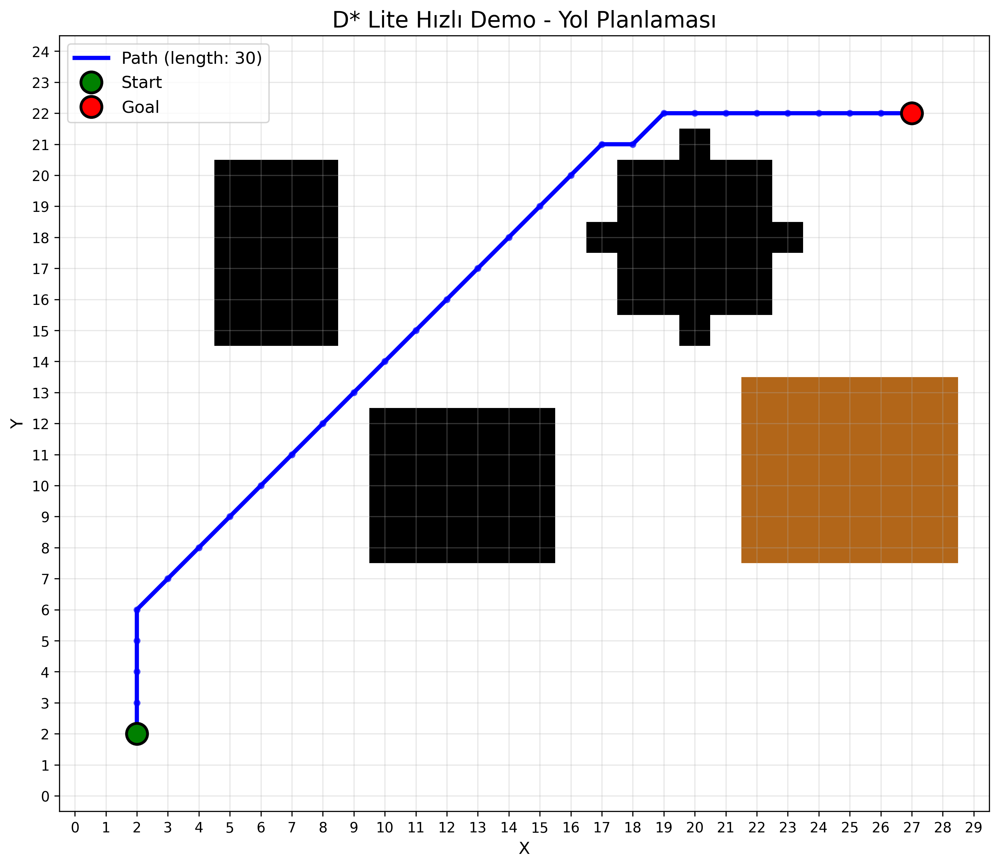
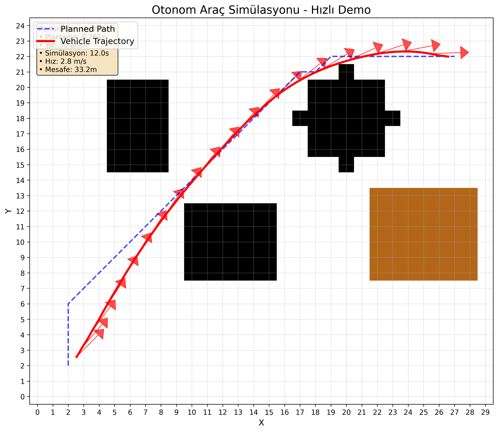
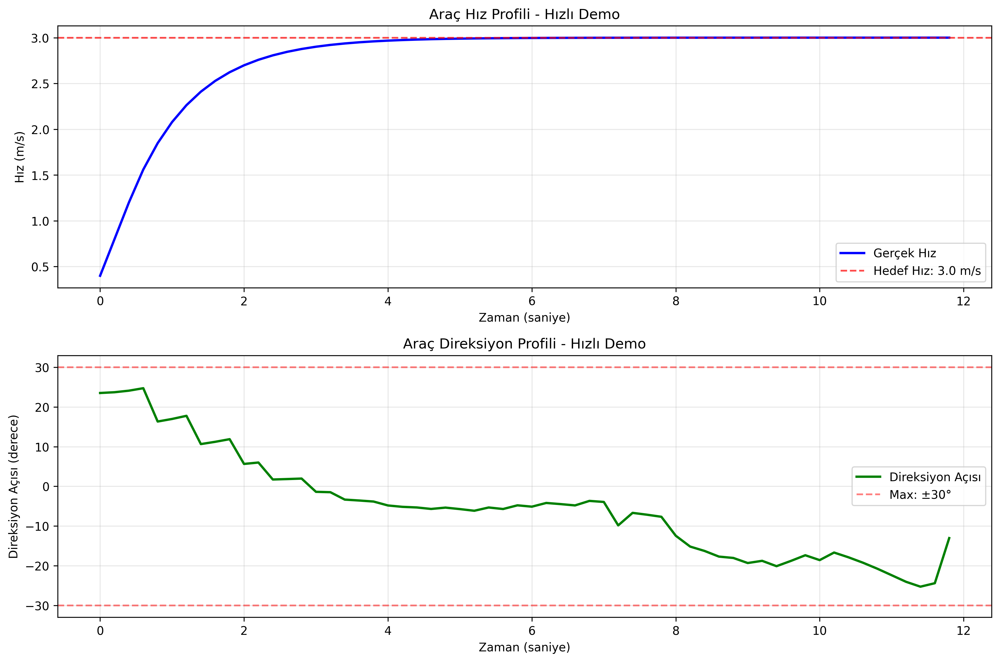
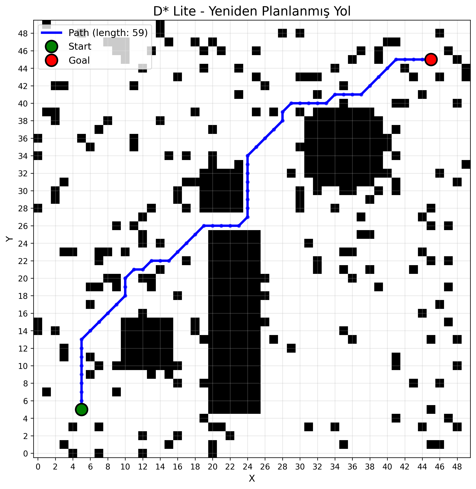
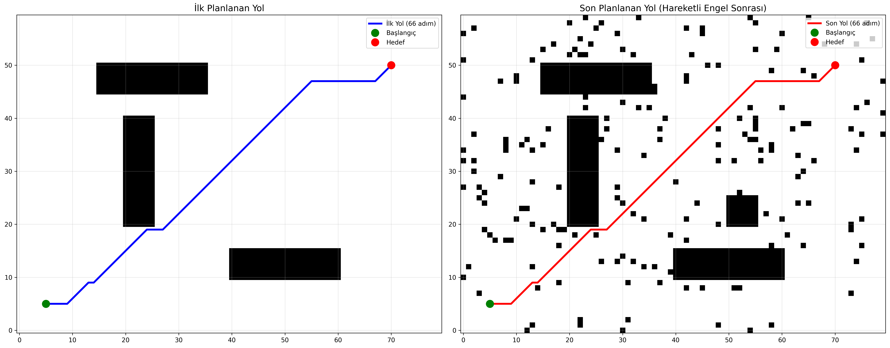
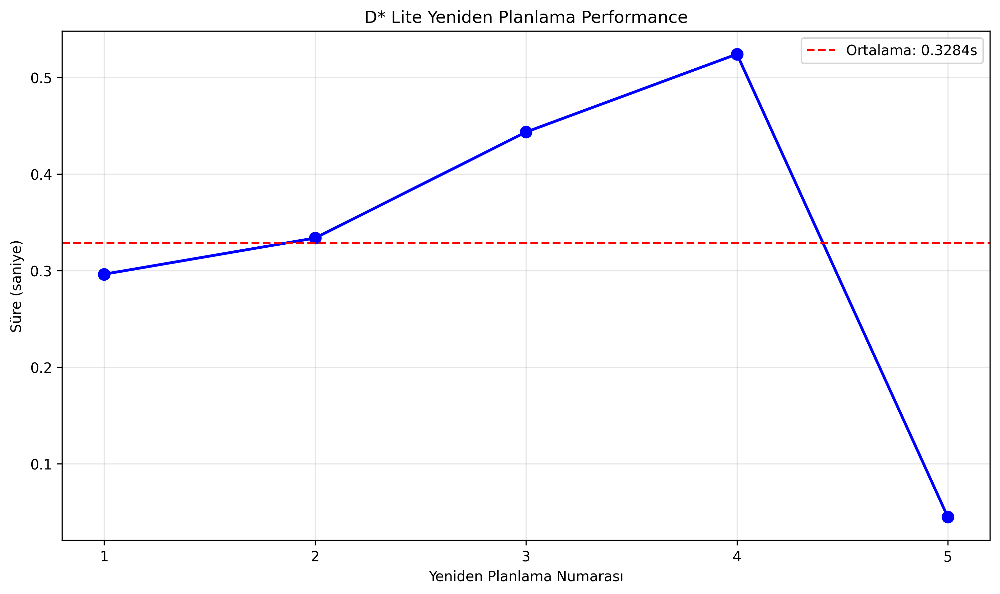
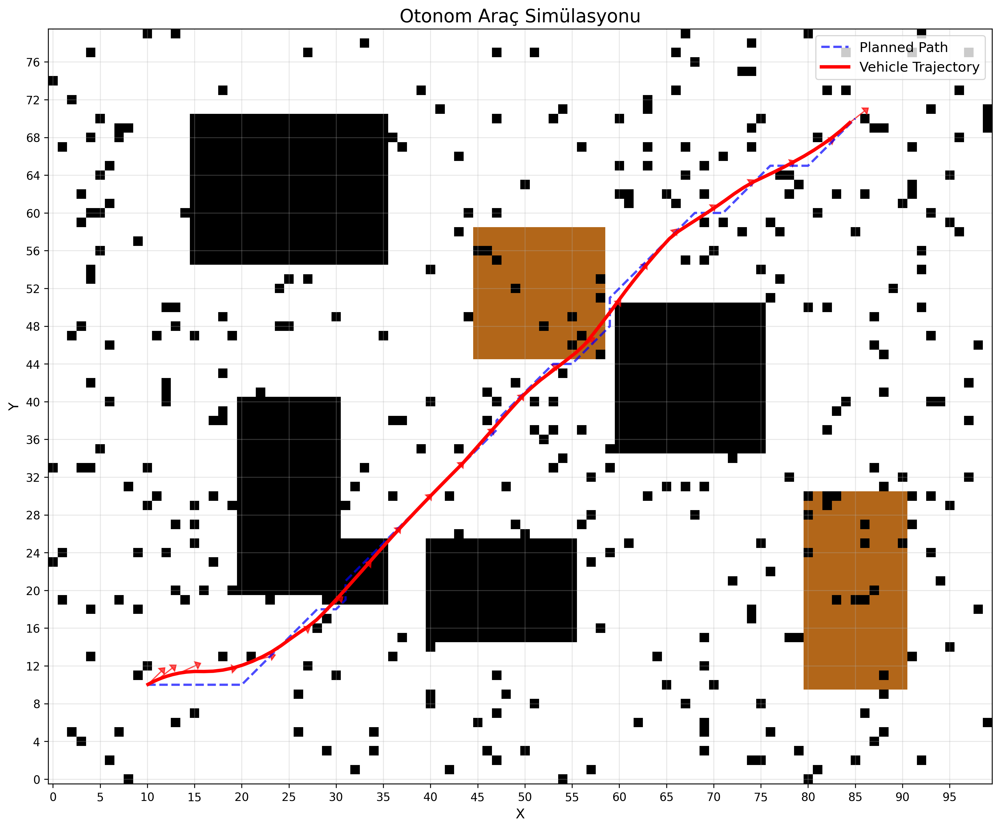
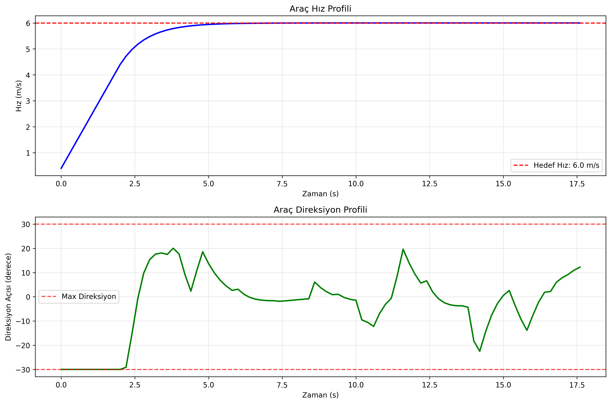
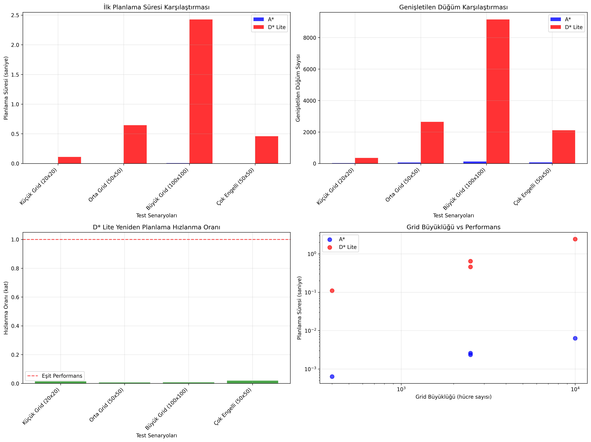

# D* Lite Tabanlı Dinamik Yol Planlama ve Trafik Simülasyonu

Bu proje, D* (D-star) ve D* Lite algoritmalarını kullanarak dinamik ortamda yol planlama yapar ve İstanbul benzeri bir trafik simülasyonu sunar. Araç kinematiği, dinamik engeller, trafik ışıkları ve yoğunluk gibi gerçekçi faktörler dikkate alınır. Tüm örnekler PNG formatında görseller üretir.

## İçindekiler
- Proje Özellikleri
- Kurulum
- Hızlı Başlangıç
- Örnek Senaryolar ve Üretilen PNG Dosyaları
- Gelişmiş Trafik Simülasyonu
- Performans Metrikleri ve Karşılaştırmalar
- Testler
- Katkıda Bulunma
- Lisans

## Proje Özellikleri
- D* ve D* Lite algoritmaları ile dinamik yol planlama
- Dinamik çevre: hareketli engeller, yol kapanmaları, trafik yoğunluğu
- Araç kinematik modeli ve temel araç takip simülasyonu
- Matplotlib ile gelişmiş görselleştirme ve otomatik PNG çıktıları
- Senaryo tabanlı test yapısı ve analiz araçları
- D* Lite ve referans bir “orijinal” D* Lite varyantı (`DStarLiteOriginal`)

## Kurulum
```bash
# Depoyu klonlayın
git clone https://github.com/yourusername/dstar-pathfinding.git
cd dstar-pathfinding

# Sanal ortam (önerilir)
python -m venv venv
source venv/bin/activate  # Windows: venv\Scripts\activate

# Gereksinimleri yükleyin
pip install -r requirements.txt

# Geliştirici modu kurulum (opsiyonel)
pip install -e .
```
Yürütme sonunda PNG görseller proje kök dizinine kaydedilir.

## Mevcut Görseller (Önizleme ve Kısa Açıklamalar)


Planlanan yolun engelleri dolaşarak başlangıçtan hedefe ulaşması.


Araç kinematik modeliyle planlanan yolun takibi ve gerçek trajektori.


Zaman ekseninde hız ve direksiyon açısı profilleri.


İlk planlanan yol ve başlangıç/hedef işaretleri.


Ortaya eklenen engel sonrası yeniden planlanan alternatif yol.


Hareketli engeller boyunca ilk ve son yolun yan yana karşılaştırması.


Her adımda yeniden planlama sürelerinin karşılaştırmalı grafiği.


Planlanan yol ve aracın izlediği gerçek trajektori (basit görünüm).


Araç hız ve direksiyon açısı zaman serileri.


A* ve D* Lite arasında süre, düğüm sayısı ve ölçeklenme karşılaştırması.

Not: Tüm görseller `examples/` klasörüne kaydedilir.

## Lisans
Bu proje MIT Lisansı ile lisanslanmıştır. Ayrıntılar için `LICENSE` dosyasına bakınız.